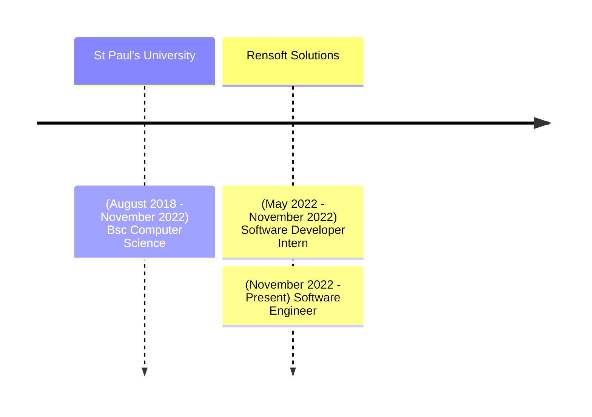

## James Kuria Chege

I'm a Software Engineer at [Rensoft Solutions](https://rensoft.co.ke) where I work on building software solutions for clients. My favorite technologies right now are: Reactjs, Nodejs, React Native (Expo), Typescript and Graphql. I'm also interested in learning more about cloud technologies and DevOps. I am currently learning about Jenkins and Docker.

### My Career Journey

**_Nov 2022 - Present_**  
**Rensoft Solutions** **(Software Engineer)**

I work on building software solutions for clients. I work on both the frontend and backend of the applications. I also work on the deployment and maintenance of the applications. I work with a team of developers and we use agile methodologies to deliver the projects. I also work with the clients to gather requirements and understand their needs. I also work with the QA team to ensure the quality of the applications.

 `Nextjs` `Spring Boot` `Typescript` `RESTful APIs` `Docker` `Jenkins` `Git & GitHub` `Nginx` 

**_May 2022 - November 2022_**  
**Rensoft Solutions** **(Software Engineer Intern)**

Developed client self service portal for insurance company. The portal was built using Nextjs, Spring Boot and RESTful APIs. The portal allowed clients to create and view their policies, make claims and view their claim history. It also allowed them to view their statements, download their policy documents and make payments.  
Example Project : [Mpawa Insurance Portal](https://rensoft.co.ke)
    
 `Nextjs` `Spring Boot` `Typescript` `RESTful APIs` `Git & GitHub`

**_Aug 2018 - Nov 2022_**  
**St Paul's University** **(Bsc Computer Science)**

I studied Computer Science at St Paul's University. I learned about software engineering, web development, mobile development, databases, computer networks and security, and data structures and algorithms.

---

#### My Skills

*]:grid-cols-3 [&>*]:grid sm:text-sm">
- Reactjs
- Nodejs
- Jenkins
- Typescript
- Graphql
- Docker
- React Native (Expo)
- Spring Boot
- Git & GitHub

---

#### My Interests

- I enjoy learning about new technologies. I'm always looking for new things to learn and new technologies to try out.
- I enjoy building software solutions that solve real world problems. I'm always looking for new projects to work on and new problems to solve.
- I enjoy working with other developers. I'm always looking for new opportunities to work with other developers and learn from them.

---

#### Contact Me

{
 // - Twitter [@nickjames_dev](https://twitter.com/nickjames_dev)
}
- GitHub [@jameskuria](https://github.com/jameskuria)
- Linkedin [@jameskuria](https://www.linkedin.com/in/jameskuria/)
- Email jameskuria04@gmail.com
- Phone <a href="tel:+254700262226">+254700262226</a>