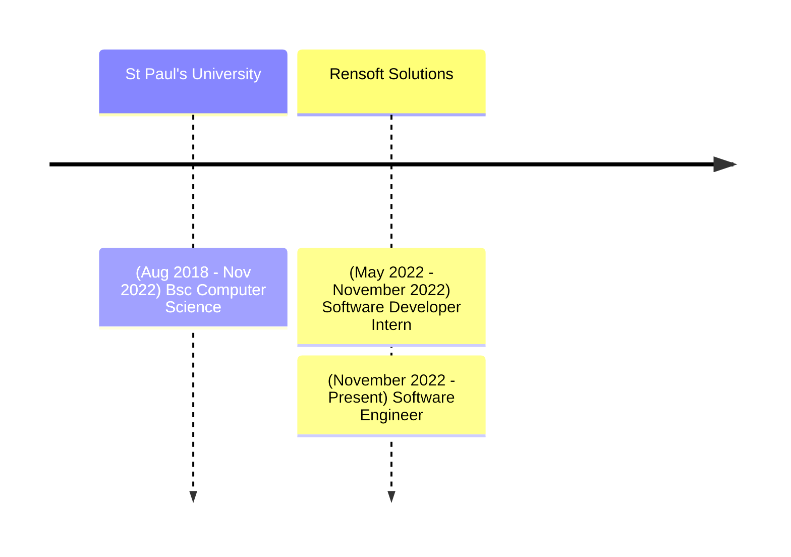

## James Kuria Chege

I'm a Software Engineer at [Rensoft Solutions](https://rensoft.co.ke) where I work on building software solutions for clients. My favorite technologies right now are: Reactjs, Nodejs, Typescript, Graphql and Spring Boot. I'm also interested in learning more about cloud technologies and DevOps. I am currently learning about Jenkins and Docker.

---

    {/* title My Career Journey */}

---

- GitHub [@jameskuria](https://github.com/jameskuria)
- Linkedin [@jameskuria](https://www.linkedin.com/in/jameskuria/)
- Email jameskuria04@gmail.com
